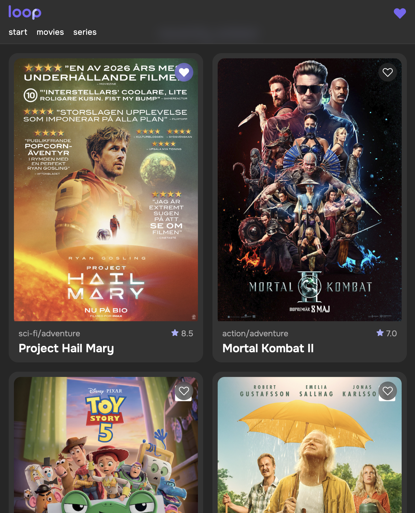

# LOOP — Streaming UI Concept

A responsive movie streaming interface built with HTML and CSS.

---

## ✨ Concept

LOOP is a modern streaming concept focused on mood, clarity, and simplicity.

Instead of overwhelming users with content, the interface emphasizes:

- calm browsing
- clear hierarchy
- subtle interactions

The project explores how a structured wireframe can be translated into a more refined and visually cohesive UI.

---

## 🧱 Built with

- HTML5 (semantic structure)
- CSS3
  - Flexbox
  - Grid
  - Custom properties (CSS variables)
- Mobile-first approach

---

## 📱 Features

- Fixed, blurred header with navigation
- Responsive movie grid (1 → 2 columns at 480px)
- Reusable movie card component
- Overlay action (save/heart icon with state)
- Icon positioned according to wireframe (top-right)
- Improved icon visibility using background and contrast
- Aspect-ratio-based image handling
- Subtle hover interactions (scale + elevation)
- Image + text split section

---

## 🎯 What I practiced

- Translating a wireframe into a working layout
- Structuring reusable UI components
- Building responsive layouts with Grid and Flexbox
- Creating a consistent visual system (colors, spacing, typography)
- Making UI decisions based on real content and readability

---

## 🧠 Key decisions

- Kept layout aligned with the original wireframe
- Solved icon visibility without changing placement
- Used a dark theme with accent color for consistency
- Focused on simplicity and readability over complexity

---

## 🚀 Next steps

- Add interactivity (toggle save state with JavaScript)
- Improve accessibility (ARIA labels, keyboard navigation)
- Create a detail page for each movie
- Expand into a full multi-page experience

---

## 📸 Preview

